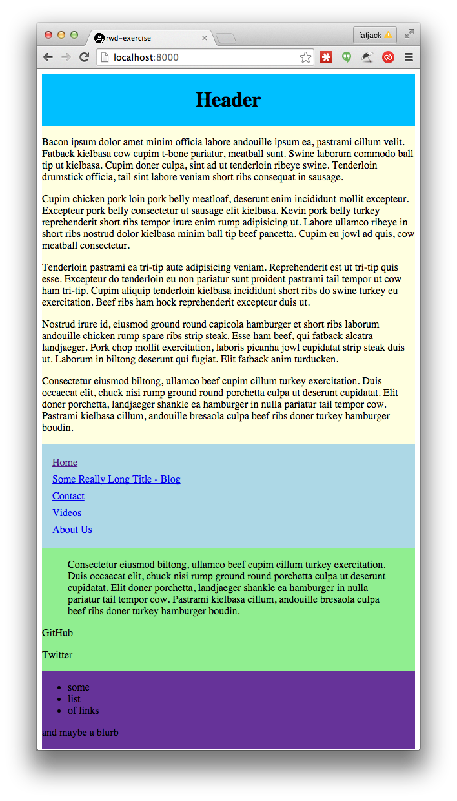
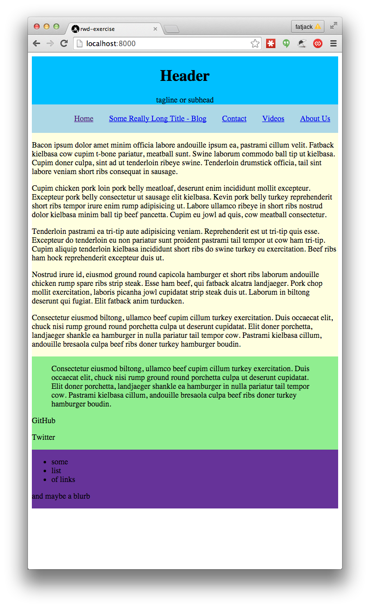
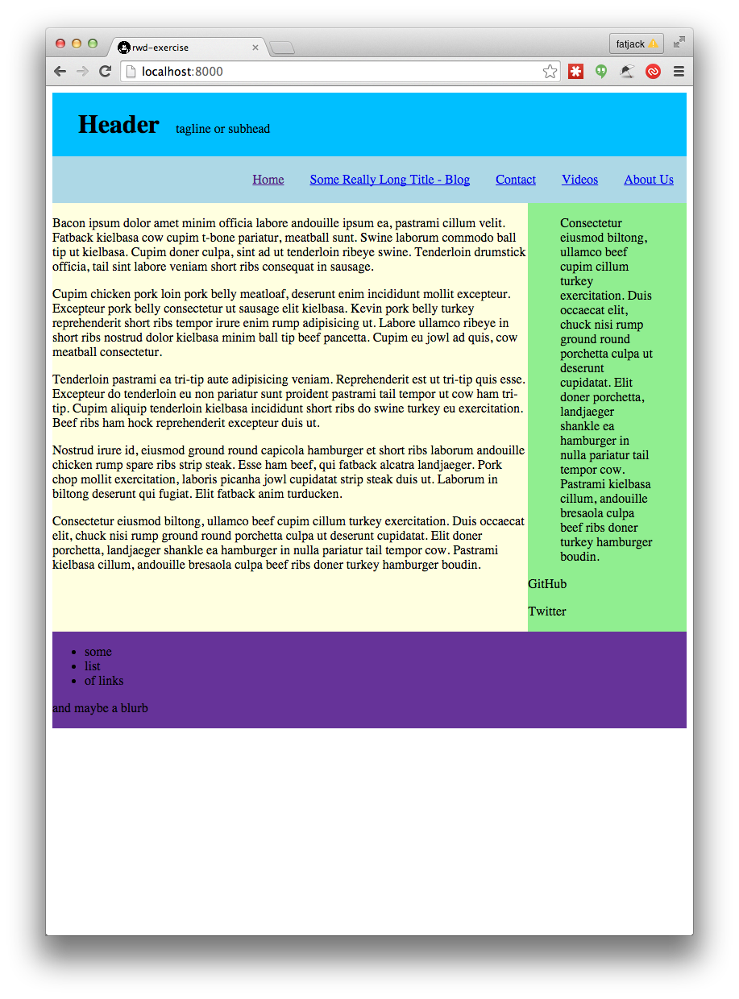
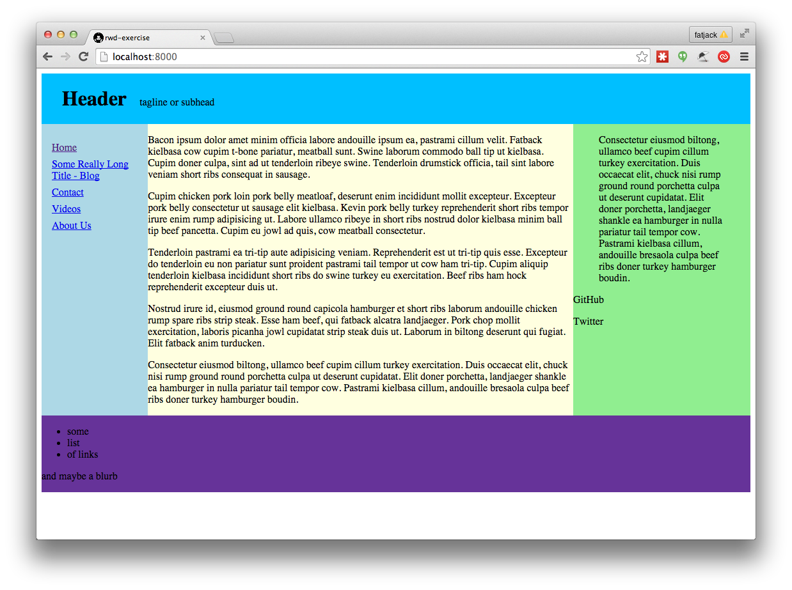

# My Lineman Application

Try to do the following exercises without touching the HTML.

Starting at the `start` branch, use media queries to make the layout match the screenshots at the various widths.

1. default (build for mobile first and it will be usable by anyone, even older browsers that don't support media queries)

2. over 40em

3. over 50em

4. over 70em

